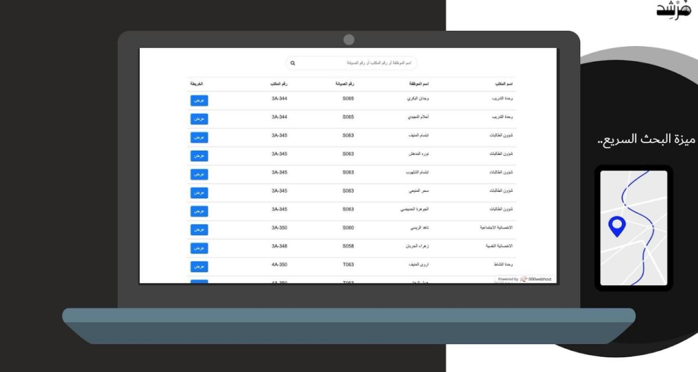
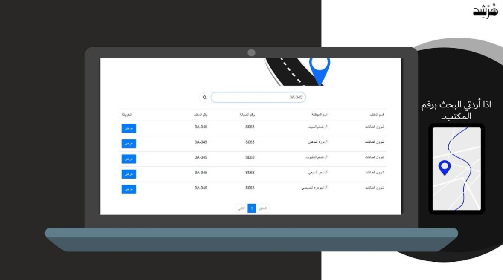
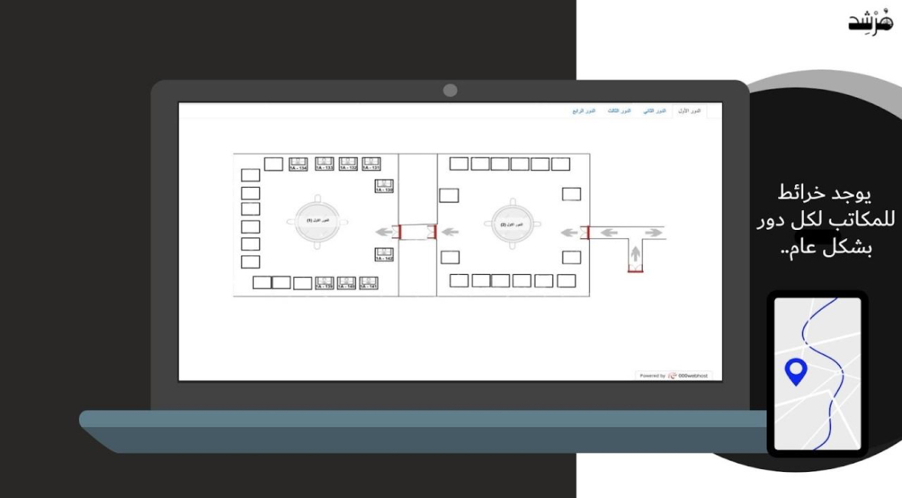

# Murshid Guidance Map App for Student Building Campus

## Introduction

Developed a web application to streamline office navigation for students and visitors at Imam Muhammad Ibn Saud Islamic University. The platform integrates a user-friendly directory system, enabling searches by faculty name, department, or office number, with results displayed in both textual and graphical formats.

 
 
 
  
  

## Technologies Used

- HTML
- Cascading Style Sheets (CSS)
- PHP
- PhpMyAdmin
- Full-Stack Development